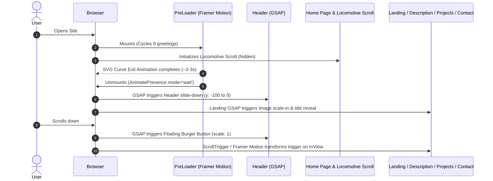
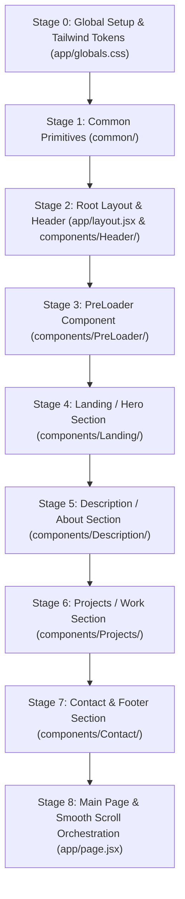

# Architecture & Top-to-Bottom Tailwind Migration Guide

This guide documents the full architecture of your Portfolio, the component hierarchy, animation lifecycles, and our step-by-step roadmap to migrate from legacy SCSS modules to pure **Tailwind CSS v4** and modern Next.js conventions.

---

## 1. High-Level Architecture & Component Hierarchy

```mermaid
graph TD
    RootLayout["app/layout.jsx (RootLayout)"]
    GlobalCSS["app/globals.css (Tailwind & Fonts)"]
    Header["components/Header"]
    HomePage["app/page.jsx (Smooth Scroll & Loader Lifecycle)"]
    
    RootLayout --> GlobalCSS
    RootLayout --> Header
    RootLayout --> HomePage
    
    Header --> HeaderNav["components/Header/navigation"]
    Header --> HeaderCurve["components/Header/navigation/Curve"]
    Header --> HeaderLinks["components/Header/navigation/Link"]
    Header --> HeaderFooter["components/Header/navigation/Footer"]
    Header --> RoundedBtn1["common/RoundedButton"]
    Header --> Magnetic1["common/Magnetic"]

    HomePage --> PreLoader["components/PreLoader (Intro Splash)"]
    HomePage --> Landing["components/Landing (Hero #home)"]
    HomePage --> Description["components/Description (About #about)"]
    HomePage --> Projects["components/Projects (Work #work)"]
    HomePage --> Contact["components/Contact (Footer #contact)"]

    Projects --> ProjectItem["components/Projects/Project"]
    Projects --> ProjectModal["Project Image Hover Modal"]
    Projects --> RoundedBtn2["common/RoundedButton"]
    
    Contact --> Semicircle["GSAP Semicircle Reveal"]
    Contact --> RoundedBtn3["common/RoundedButton"]
    Contact --> LocalTime["common/LocalTime"]
    Contact --> Magnetic2["common/Magnetic"]
```

---

## 2. Animation & Interaction Lifecycle

---

## 3. Directory Conventions & Cleanup Strategy

### Component File Naming
Adopt `index.jsx` per component directory:
- `components/Header/index.jsx` $\rightarrow$ imported cleanly as `import Header from '@/components/Header'`
- `common/RoundedButton/index.jsx` $\rightarrow$ imported cleanly as `import RoundedButton from '@/common/RoundedButton'`
- `common/Magnetic/index.jsx` $\rightarrow$ imported cleanly as `import Magnetic from '@/common/Magnetic'`

---

## 4. Top-to-Bottom Migration Roadmap

---

### Migration Checklist

- [x] **Stage 0: Global Setup & Tailwind Tokens**
  - [x] Configure Tailwind v4 `@theme` tokens in `app/globals.css` (custom colors, fonts, noise, utilities)
  - [x] Standardize `app/layout.jsx` fonts and metadata
- [ ] **Stage 1: Common Primitives (`common/`)**
  - [ ] `common/Magnetic` (Rename to `index.jsx`, ensure clean ref passing & cleanup)
  - [ ] `common/RoundedButton` (Migrate SCSS to Tailwind utilities + GSAP fill animation)
  - [ ] `common/LocalTime` (Tailwind typography & client time formatting)
- [ ] **Stage 2: Header & Navigation (`components/Header/`)**
  - [ ] `components/Header/navigation/Curve` (Tailwind SVG container)
  - [ ] `components/Header/navigation/Link` (Tailwind hover & active indicators)
  - [ ] `components/Header/navigation/Footer` (Tailwind social links)
  - [ ] `components/Header/navigation` (Tailwind sliding drawer menu)
  - [ ] `components/Header` (Tailwind sticky bar, magnetic logo, floating action burger)
- [ ] **Stage 3: PreLoader (`components/PreLoader/`)**
  - [ ] Migrate PreLoader overlay, cycling typography & SVG exit curve to Tailwind
- [ ] **Stage 4: Landing / Hero Section (`components/Landing/`)**
  - [ ] Migrate hero layout, text stroke outline, and GSAP scale animations to Tailwind
- [ ] **Stage 5: Description / About Section (`components/Description/`)**
  - [ ] Migrate masked text reveal and responsive layout to Tailwind
- [ ] **Stage 6: Projects / Work Section (`components/Projects/`)**
  - [ ] `components/Projects/Project` (Row hover states & GitHub/live links in Tailwind)
  - [ ] `components/Projects` (Interactive modal preview & floating cursor follower in Tailwind)
- [ ] **Stage 7: Contact & Footer Section (`components/Contact/`)**
  - [ ] Migrate semicircular curve, CTA typography, resume download, and socials grid
- [ ] **Stage 8: Main Page & Final Cleanup (`app/`)**
  - [ ] Clean imports in `app/page.jsx`
  - [ ] Delete legacy `.module.scss` files
  - [ ] Run full build & lint verification
